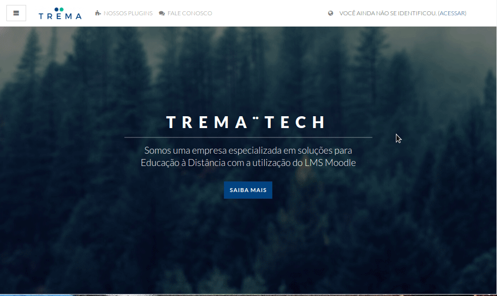

The "Trema" Moodle Theme
============================

The theme trema focus in usability and beaty, so for that became real 
the developers try to make something clean and usable for everyone in community.

The main idea from this theme is use Moodle not necessarily 
with other site for divulgation.

Nice features in trema:
 - It's based in theme boost, so will continue compatible with Moodle 
 for a long time.
 - The frontpage is fully customized. It's possible to change the image 
 banner, you can create up to six beautiful cards with custom contents and
 you can add custom HTML content with no restrictions.
 - The login page is awesome with [Particles lib](https://github.com/mmacheerpuppy/particles.js).
 - We really use [Bootstrap](https://getbootstrap.com/) to make theme fully responsive.
 - The footer is pretty customizable and we have a exclusive admin area 
 block that just one administrator of Moodle can see and access.
 - Thinking a litte more about the administrators we made the admin 
 dashboard area. So they can see in real time some infos about their Moodle.
 
 - The colors scheme can be changed in theme settings.

Developed and maintained by
===========================
Rodrigo Mady  
Moodle profile: https://moodle.org/user/profile.php?id=2435964  
Web profile:    https://github.com/rmady  

Trevor Furtado  
Moodle profile: https://moodle.org/user/profile.php?id=1192335  
Web profile:    https://github.com/trevorfurtado  

Support
=======
As Trema is licensed under the GNU GPLv3 License it comes with NO support. So if you need some help
 talk to us in 'Moodle profile' in 'Developed and maintained by' above and we can discuss some improvements.
To inform errors access [Github Issues](https://github.com/trema-tech/moodle-theme_trema/issues).

Installation
============
Ensure you have the version of Moodle as stated above in 'Required version of Moodle'. This is 
necessary as the theme relies on underlying core code.
Move the folder `trema` to `/theme/` folder from your Moodle installation.
Access the Moodle Administration page (/admin) for do the necessary updates in your database.

Git 
Download the stable version of theme in:
`git clone https://github.com/trema-tech/moodle-theme_trema trema`

For uninstalling trema you must change the theme. And in `/theme/` remove the folder `trema`.

See the demo site
=======================
A demo site showing all available features of [Theme Trema](https://trema.tech).

Documentation
=============
Documentation is available in [Theme Trema](https://trema.tech).

Particles.js
============
The theme trema use the [particles.js](https://github.com/mmacheerpuppy/particles.js) a lightweight 
JavaScript library for creating particles in login.